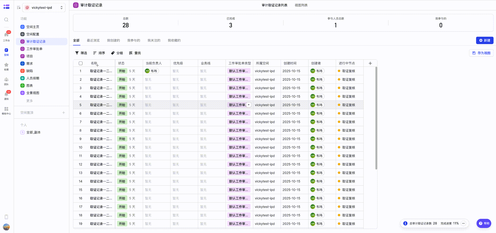

### 效果图

#### 实例及表单数据字段做聚合时的效果

#### 实例及表单数据一一展示时的效果

**注意**：IsAggregated = true 时，将实例及表单数据字段做聚合批量提交，IsAggregated = false 时，将实例及表单数据一一展示批量提交，

## 项目介绍

【2.0】批量操作-按钮批量操作点位，支持填写节点表单信息并批量流转

注意：当前插件执行时会过滤掉非进行中的节点，支持节点表单里的单行文本、多行文本、富文本、人员类型、单选、多选、开关类型字段。不支持节点排期估分的批量修改。

**适用场景举例**：使用飞书项目节点流进行需求管理时，评审会后，批量流转需求评审节点。

## 开发者

### 环境准备

1. 由于插件存在跨域问题，无法直接访问 openAPI 服务，因此**请提前准备后端代理服务**以保障开发顺利进行。

2. 将步骤 1 中准备的代理服务域名，配置到 `src/constants/index.ts` 文件的 `requestHost` 中。

2. 插件开发的详细操作指南，可参考 [开发者手册](https://project.feishu.cn/b/helpcenter/1p8d7djs/nh4exbsn)。

### 启动项目

1. 打开「飞书项目・开发者后台」中对应的插件详情页。

2. 在左侧导航栏切换至「插件功能」标签页，进行如下配置：

    1. 添加 「按钮」-「批量操作」 构成并进行下一步配置。
    2. 「工作项类型」 选择 「全部」工作项。
    3. 「适用端」 仅选择 「网页端」。
    4. 「网页端按钮位置」 选择 「批量操作」。
    5. 「网页端 resourceId」修改为 `button_web_op`。
    6. 「弹窗最小尺寸」改为「固定宽度」和「固定高度」，「固定宽度」设置为 `2*24+1000`，「固定高度」设置为 `56+24+480`。
    7. 确认配置并保存。
    8. 「复制初始化命令」，在本地执行以生成插件工程框架。
    9. 将本项目的 `src` 文件夹替换到生成的工程中。

3. 在左侧导航栏切换至「权限管理」标签页，完善插件权限配置，需勾选以下权限：

    - 勾选 `获取工作项实例信息` 权限
    - 勾选 `更新工作项实例数据` 权限
    - 勾选 `获取空间下的基础配置` 权限
    - 勾选 `获取空间下的高级配置` 权限
    - 勾选 `获取视图&度量数据` 权限

4. 补充完成插件的基本信息。

5. 在项目目录下运行：`lpm start`。

6. 然后访问「飞书项目·开发者后台」首页，在页面左下角启用插件的本地调试模式。

7. 最后打开「飞书项目」，切换到任意工作项，批量选择模版一致的工作项实例集合右下角就会出现「批量操作」的按钮，即可预览插件效果。

### 发布你的插件

1. 在终端上运行 `lpm release` 命令来构建产物并上传。

2. 打开「飞书项目·开发者后台」相应插件详情页。

3. 左侧导航切换到「插件发布」tab。

4. 点击「创建版本」填写相关信息，在「产物版本』中选择对应版本产物并提交。

5. 回到「插件发布」页面，会出现一条新增的版本记录，点击该记录的「申请发布」按钮。

6. 恭喜，你现在已经成功发布了一个插件，可以回到「飞书项目」插件市场去安装并尽情使用啦！

## 用户侧
1. 批量选择模版一致的工作项实例集合右下角就会出现「批量操作」的按钮，就可以进行批量状态流转了

